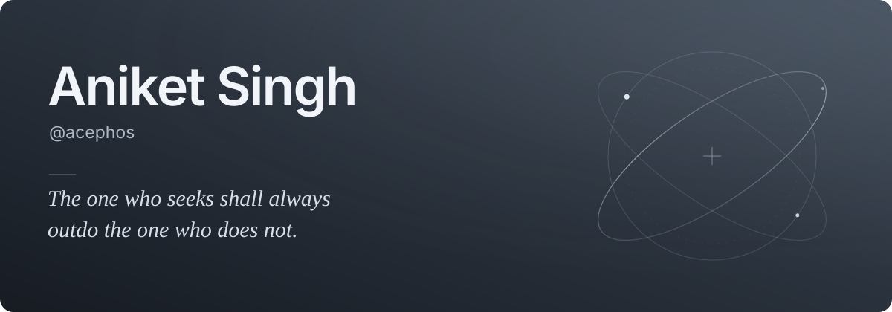

<picture>
  <source media="(prefers-color-scheme: dark)" srcset="assets/header-dark.svg">
  <source media="(prefers-color-scheme: light)" srcset="assets/header-light.svg">
  
</picture>

  <a href="#selected-work">Selected work</a> &nbsp; / &nbsp;
  <a href="#field-notes">Field notes</a> &nbsp; / &nbsp;
  <a href="https://www.linkedin.com/in/an1ket-s1ngh">LinkedIn ↗</a>

I’m **Aniket**, an engineer in Hyderabad working on **agent harnesses, developer tooling, and service modernization**. I like the parts of a system that make everything else trustworthy: durable state, clear boundaries, and a way back when things go wrong.

`Rust` · `TypeScript` · `Go` · `Nix` · `PostgreSQL` · `Linux`

## Selected work

### 01 / [acex](https://github.com/acephos/acex)

**A terminal control plane for agent sessions.** A Rust TUI for observing and controlling sessions, with checkpoint validation and recovery paths. Available as a source-build preview.

[Explore the code ↗](https://github.com/acephos/acex) · [Live Linux walkthrough ↗](https://github.com/acephos/acex/blob/master/docs/artifacts/profile-verification-2026-10-01.md)

### 02 / [nixos-wsl](https://github.com/acephos/nixos-wsl)

**A development environment you can account for.** Pinned NixOS/WSL configuration, locked CLI installs, and build receipts that distinguish saved source from a verified system. Full system-build CI passes; a Windows restore drill remains pending.

[Explore the configuration ↗](https://github.com/acephos/nixos-wsl) · [Recovery evidence ↗](https://github.com/acephos/nixos-wsl/blob/main/docs/RESTORE_EVIDENCE.md)

### 03 / [workstream](https://github.com/acephos/workstream)

**Named model sessions with durable state.** A TypeScript CLI with serialized writes, atomic snapshots, and explicit host checks that leave receipts. The live adapter generates text; checks run on the host.

[Explore the code ↗](https://github.com/acephos/workstream) · [Reliability case study →](docs/workstream-reliability.md)

### 04 / [strangler-lab](https://github.com/acephos/strangler-lab)

**Move a service without losing its state.** A Node-to-Go migration lab exploring read-only shadow traffic, keyed retries, and state-preserving cutover and rollback in a controlled local stack.

[Explore the code ↗](https://github.com/acephos/strangler-lab) · [Migration walkthrough →](docs/strangler-walkthrough.md)

## Field notes

| Write-up | What it covers |
| :--- | :--- |
| [Keeping model sessions consistent](docs/workstream-reliability.md) | Concurrent writes, failure recovery, and verification receipts. |
| [A migration with a way back](docs/strangler-walkthrough.md) | Shadow comparisons, retry safety, and cutover/rollback. |

<strong>Verification notes & other experiments</strong>

The project links lead to implementation and test evidence, with their limits stated explicitly.

- **acex:** Linux live recording, Windows/macOS offline CI, and synthetic reducer/render timings. The timings are not live agent-load measurements.
- **nixos-wsl:** Full system-build CI and build receipts. Actual Windows restore evidence is still pending.
- **workstream:** 22 tests in CI on Node 20/22/24. Host checks and a text-generating adapter; independent worker execution is outside the current MVP.
- **strangler-lab:** 24 contract assertions, completed read-only shadow comparisons, and controlled cutover/rollback. State is in memory; crash durability and production SLA claims are outside this lab.

Earlier experiments include [Stega-Tool](https://github.com/acephos/Stega-Tool), an educational concealment tool with persisted-file round-trip tests, and the [RBAC dashboard](https://github.com/acephos/rbac-management-dashboard), whose authorization/RLS changes await staged database verification.

Coursework and browser exercises remain learning history. Imported research and starter snapshots retain upstream attribution. Private operational assets and employer work are outside this public showcase.

---

  <strong>Build deliberately. Verify the behavior. Keep a recovery path.</strong> 
  <a href="https://github.com/acephos?tab=repositories">Repositories</a> &nbsp; · &nbsp;
  <a href="https://www.linkedin.com/in/an1ket-s1ngh">LinkedIn</a>

